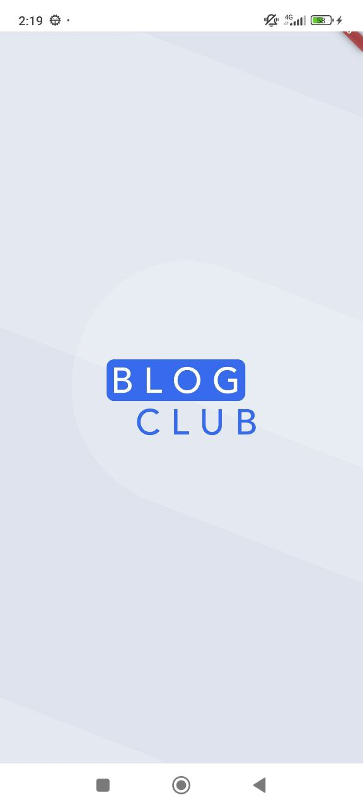
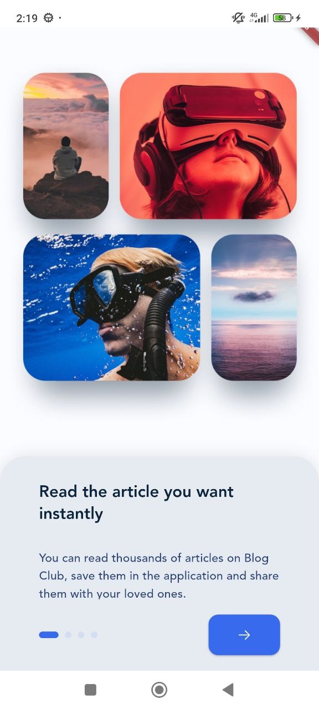
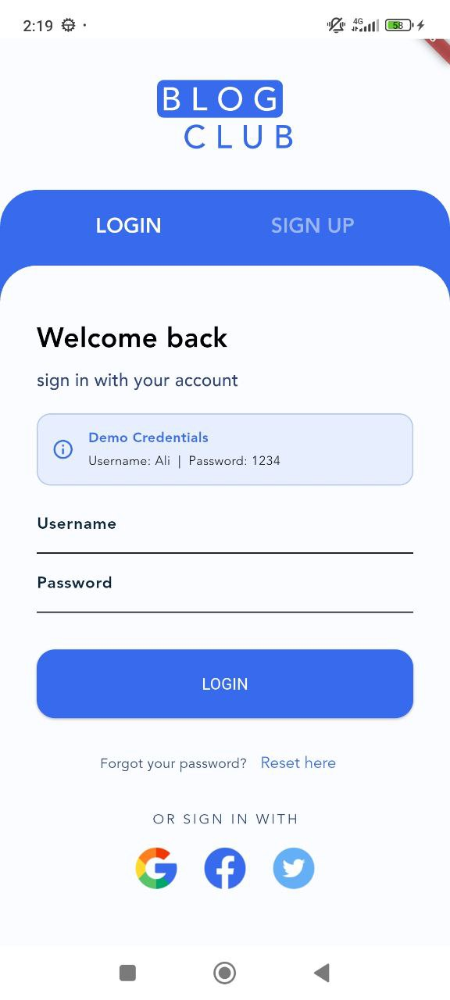
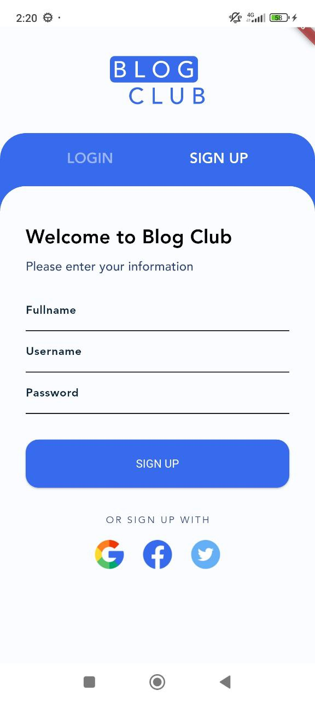
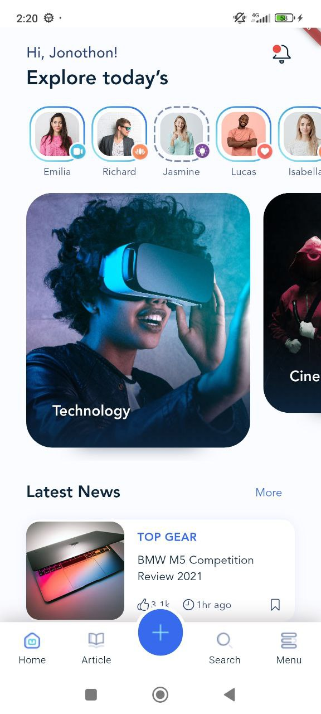
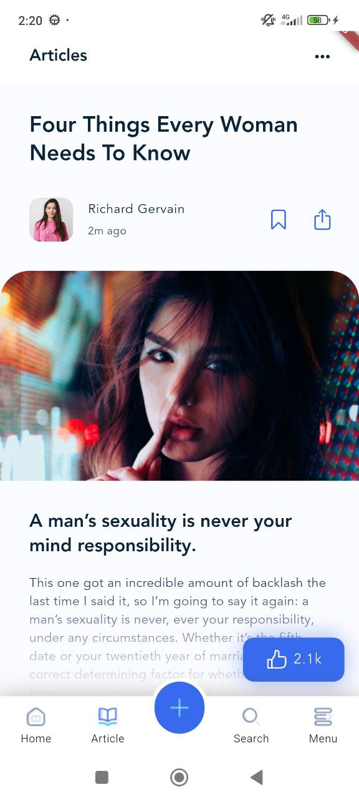
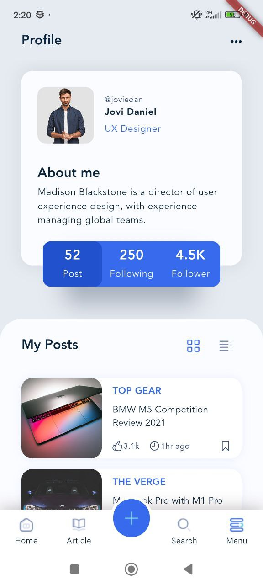

# 📱 Flutter BlogClub

A beautiful and modern blog reading application built with Flutter. This is my **second Flutter app** created as part of my Flutter learning journey! 🚀

## 📖 About This Project

BlogClub is a feature-rich blog reading application that showcases various Flutter concepts and UI/UX design patterns. The app includes authentication screens, user profiles, article reading experiences, and smooth navigation between different sections.

As my second Flutter project, this app helped me learn and implement:
- Advanced UI design and custom widgets
- State management with StatefulWidgets
- Navigation and routing
- Custom themes and styling
- Image and asset management
- Form validation and user input handling
- Responsive layouts and animations

## ✨ Features

- 🎨 **Beautiful UI Design** - Modern and clean interface with custom styling
- 🔐 **Authentication System** - Login and Sign-up screens with validation
- 🏠 **Home Feed** - Browse latest articles and trending stories
- 👤 **User Profile** - Personalized profile page with user stats
- 📰 **Article Reading** - Immersive article reading experience
- 🎯 **Onboarding Flow** - Smooth introduction for new users
- 🎭 **Custom Splash Screen** - Branded app launch experience
- 📊 **Story Feed** - Instagram-like story viewing feature
- 🏷️ **Category Navigation** - Browse articles by categories
- 🌙 **Consistent Theme** - Unified color scheme and typography
- ⚡ **Performance Optimized** - Extensive use of const constructors for better performance

## 📸 Screenshots

### Splash & Onboarding
<p align="center">
  
  
</p>

### Authentication
<p align="center">
  
  
</p>

### Main Features
<p align="center">
  
  
  
</p>

## 🛠️ Technologies & Packages

- **Flutter SDK** - Cross-platform mobile development framework
- **Dart** - Programming language
- **flutter_svg** - SVG rendering support
- **dotted_border** - Custom border styling
- **smooth_page_indicator** - Page view indicators for onboarding
- **build_runner** - Code generation for assets
- **flutter_gen_runner** - Asset code generation

## 🏗️ Project Structure

```
lib/
├── main.dart           # App entry point and main navigation
├── splash.dart         # Splash screen
├── onBording.dart      # Onboarding screens
├── auth.dart           # Authentication (Login/Sign-up)
├── home.dart           # Home screen with feeds
├── article.dart        # Article reading screen
├── profile.dart        # User profile screen
├── data.dart           # Data models and mock data
├── carousel/           # Custom carousel slider widget
└── gen/                # Generated asset files
```

## 🚀 Getting Started

### Prerequisites

- Flutter SDK (3.7.0 or higher)
- Dart SDK
- Android Studio / VS Code
- An Android or iOS device/emulator

### Installation

1. **Clone the repository**
   ```bash
   git clone https://github.com/Ali-HajiAbdollahi/flutter_blogclub.git
   cd flutter_blogclub
   ```

2. **Install dependencies**
   ```bash
   flutter pub get
   ```

3. **Generate asset files**
   ```bash
   dart run build_runner build
   ```

4. **Run the app**
   ```bash
   flutter run
   ```

## 🎯 Demo Credentials

To test the login functionality, use these credentials:
- **Username:** `ALI`
- **Password:** `1234`

## 🤝 Contributing

This is a learning project, but suggestions and feedback are always welcome! Feel free to:
- Open an issue
- Submit a pull request
- Share your thoughts

## 📝 License

This project is created for educational purposes as part of my Flutter learning journey.

## 👨‍💻 Author

**Ali Haji Abdollahi**
- GitHub: [@Ali-HajiAbdollahi](https://github.com/Ali-HajiAbdollahi)

## 🙏 Acknowledgments

- Flutter team for the amazing framework
- The Flutter community for inspiration and resources
- All the package developers whose work made this project possible

---

⭐ If you found this project helpful for your Flutter learning journey, please consider giving it a star!

**Made with ❤️ and Flutter**
